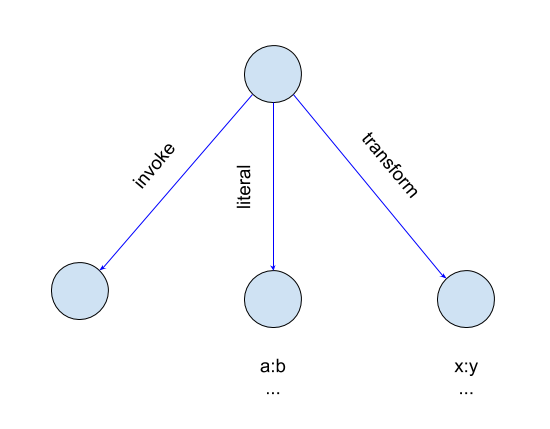
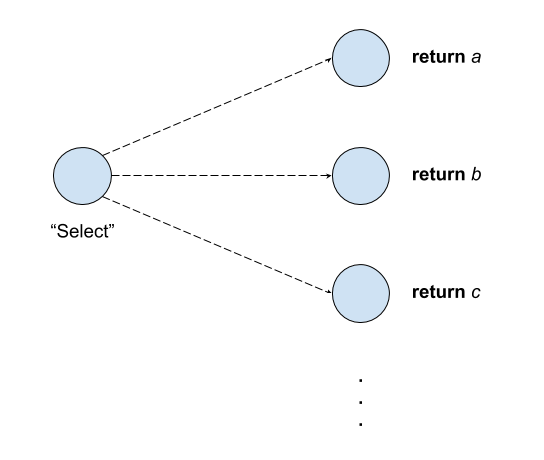

# Documentation

## Mechanics

To keep computation feasible while not constraining network fanout, a spiking neural network (SNN) rather than classical neural network is used. That is to say, activation is binary rather than continuous. This mimics biological systems but diverges from state-of-the-art artificial systems. While this means that the resulting model is not differentiable and gradient descent does not apply, this allows most paths of evaluation to drop out in any given computation. Furthermore this maps well to executable semantics, and allows for cyclic network topologies that would not preserve Bayesian semantics.

### Synapses

The SNN operates as a time-continuous mapping from states to actions. The line between states and actions is blurred, as actions are themselves atoms of state, the chainlike cascade of which is similar to the advance of a program counter in a low-level program.

The state representation and causal chain mechanism is heavily biologically inspired. State as described above is the abstract aggregate of recency-weighted node activations. The causal mapping function (synapse) is a linear combination of time-decaying node evaluations, where evaluation above a threshold corresponds to a subsequent activation.

Biologically, several more complex mechanisms are at work, which are omitted from the prototype in the short term. In particular, here decay is linear, and there is no temporal summation. Furthermore, activation is siloed into contexts rather than global.

### Distributions

To enable adaptation, the coefficients of a synapse are modeled as distributions. These distributions are unimodal and evidence-based.

Hypotheses for distributions come from Hebbian (implicit) reinforcement and reward/penalty-based (explicit) reinforcement. Divergent hypotheses can be addressed by adding additional nodes to capture more intermediate state. Exact mechanics are under active development.

Formerly, the values generated by these distributions contained a random perturbation. However, experimentally, merely incorporating causal feedback in conjunction with race conditions seems sufficient to guide convergence via reinforcement.

## Application

This AI operates as an adaptive program. Rather than bootstrapping it with structure and training data, one needs to bootstrap it with a base program. For a language-based approach to intelligence, for example, it is reasonable that this base program should be a form of sliding window _n_-gram interpreter in something resembling a REPL, keeping the sequence recognition facility factored appropriately so that the program can reuse it to recognize sequences at multiple levels. It would then also be helpful to include explicit graph modification and reinforcement commands (e.g. a basic DSL). Thereafter further adaptation or explicit programming through the parser constitutes a form of online learning.

The problem space of designing the bootstrap program is itself an interesting one, and the above proposal is only an example approach. This example should allow it to achieve the milestone of being an extensible programming language, from which the next challenge would be to extend it to the ambiguity of natural language. Many further facilities would be needed to bridge the gap, but these facilities should themselves be encodable into the adaptive program space.

### Scripting features

The current prototype capitalizes on the programmability of this architecture and hybridizes with scripting characteristics such as dictionary storage, stack frames, and calling convention. It is unclear whether the resulting reduction in generality/inferential power is significant, but at the very least this should serve as a platform capable of implementing a fully extensible, potentially ambiguous programming language.

#### Native value

Since every node represents an atom of data, every node is permitted a native (interop) value. This can, for example, be an integer, string, or Java object instance.

#### Dictionary storage

Furthermore every node is allowed a map from node keys to node values. This allows us to implement higher level scripting behavior and facilitates explicit computation.

When values are queried, set, or cleared, [EAV](https://en.wikipedia.org/wiki/Entity%E2%80%93attribute%E2%80%93value_model) proxy nodes are activated in the local context. These nodes signify the (object, key) and (object, key, value) tuples. Future work may generalize activation to other contexts and/or latch these activations rather than pulse them.

#### Contexts (stack frames)

To improve parallelism and facilitate attribution, node activation is evaluated in contexts. Nodes activated under a particular context do not affect nodes in other contexts (except through structural alterations).

Each context is itself a node. The properties of that node behave as an ambient map of keys to values, serving as an auxiliary working memory to facilitate explicit computation. This should be treated akin to an open-ended register bank.

#### Calling convention

A calling convention allows execution to descend into a context stack and allows us to encode subroutines that can operate quickly and in parallel while blocking execution in their invoking causal chain. This in particular is not backed by neurology but is a tried and true construct in computer science.

(OUT OF DATE) The calling convention is encoded in the dictionary storage of a particular node.



The keys here are nodes assigned special meaning by the system, including "invoke", "literal", and "transform". When a node with an "invoke" property is activated, it acts as a subroutine call, and its causal chain is suspended (that is, subsequent activations do not occur) until the call has returned a value or become idle. The node identified by the "invoke" key is the entrypoint of the subroutine, which is activated in the new context. The new context is a child of the invoking context and is prepopulated with keys and values specified by the "literal" and "transform" nodes, if present. "literal" key-value pairs are imparted directly onto the child context, while "transform" pairs transform the calling context such that the property map is a mapping from the child keys to parent keys.

The parent context node is available at a special entry on the context. Child contexts may use this to affect their parent context.

Return values are assigned by setting another special entry on the context. This value is also assigned to the calling context, keyed by the invocation node. If the invoking causal chain has not yet continued, it is signaled to continue at this point. Subsequent return values can be assigned as well for a generator- or stream-like return pattern. Each time, the appropriate EAV proxy nodes are activated as well, in both contexts.

Runtime exceptions may occur and are handled by activating an exception handler node specified on the invoking context. If no exception handler is specified, the causal chain does not continue (the invocation node subsequently will not downstream an activation) and the exception is rethrown in the parent context.

For alternatives considered, see [Return semantics](https://docs.google.com/document/d/1U33hYAovcBOEtXT3TJOVQVr8OlJJkWpQPzqIL3nnsWA).

## Examples

### Bernoulli bandit

_k_-armed bandit is a classic demonstration of reinforcement learning. However, as the executable neural graph is not itself an optimizer, changes in utility need to be wired in with its reinforcement hooks.

For a naive approach, consider the following network, which just represents the problem to be learned as the function that selects which arm to pull.



### Hello World

```
print(value: "Hello, world!")
```

## Early limitations

It is well known that biological neural systems do segregate and specialize, so it is likely that at some point these mechanics will need to be incorporated. Furthermore the proof of concept does not model different neuromodulators.

## Relation to prior art

Binary and topologically unconstrained networks have been investigated in the past, but as far as I can tell they have attempted to operate on pure convergence, with constraints imposed upon global heuristics (“energy”). More recent research (including deep learning) has focused on function approximation. The area of focus this paradigm attempts to exploit is the adaptation of a self-modifying, Turing-complete program.